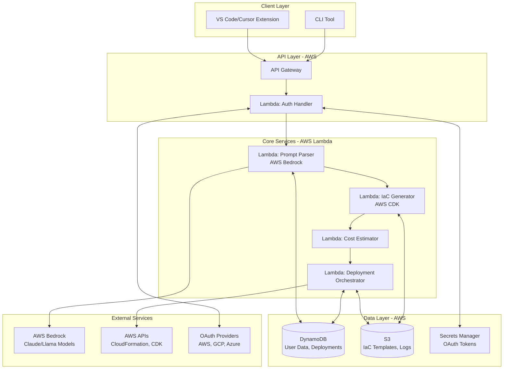
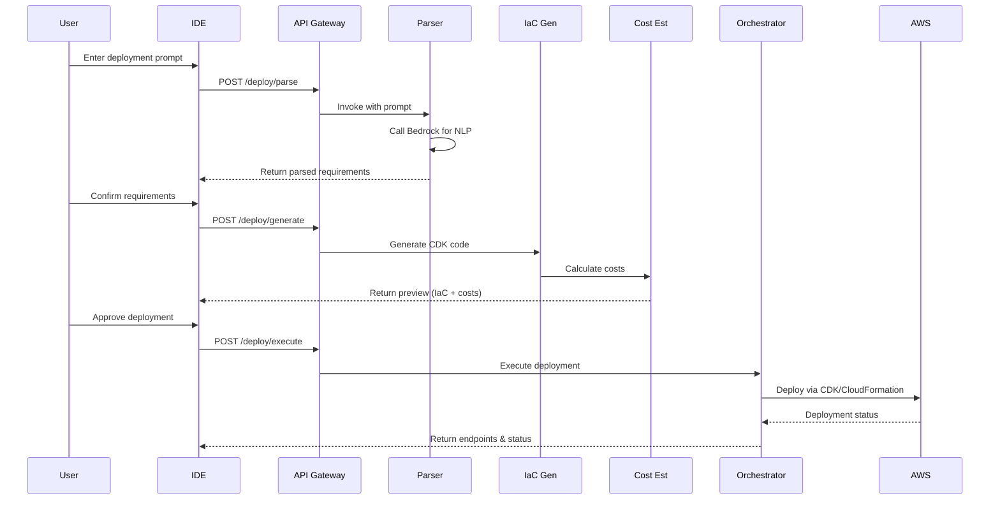

# Design Document: CloudWhisper

## Overview

CloudWhisper is a serverless AI-powered platform that translates natural language deployment prompts into executable Infrastructure-as-Code (IaC) for AWS cloud deployments. The system is designed for India's developer ecosystem, with emphasis on accessibility (Hinglish support), cost transparency (Free Tier prioritization), and low-bandwidth optimization.

The platform follows an agentic workflow pattern where user prompts flow through multiple specialized components: prompt parsing (AWS Bedrock), IaC generation (AWS CDK), cost estimation, and deployment orchestration. The architecture prioritizes serverless components (Lambda, API Gateway) to minimize operational costs and maximize scalability.

Key design principles:
- **Simplicity First**: Natural language interface eliminates cloud expertise barriers
- **Cost Transparency**: Always show estimates before deployment
- **Security by Default**: OAuth-only authentication, encrypted credential storage, least-privilege IAM
- **Offline-Capable**: IDE extension caches templates for low-bandwidth scenarios
- **Educational**: Generated IaC includes plain language comments to teach cloud concepts

## Architecture

### High-Level Architecture



### Detailed AWS Architecture Diagram

```mermaid
graph TB
    subgraph Internet["Internet"]
        USER[User: VS Code/Cursor IDE]
        BROWSER[User: Web Browser]
    end
    
    subgraph AWS_Region["AWS Region: us-east-1"]
        subgraph Edge["Edge Services"]
            CF[CloudFront CDN<br/>Static Assets]
            R53[Route 53<br/>DNS]
        end
        
        subgraph API_Layer["API Layer"]
            APIGW[API Gateway REST API<br/>cloudwhisper-api<br/>Rate Limiting: 1000 req/sec]
            WAF[AWS WAF<br/>DDoS Protection]
        end
        
        subgraph Compute["Compute Layer - Lambda Functions"]
            AUTH_FN[Auth Handler<br/>Runtime: Node.js 18<br/>Memory: 256MB<br/>Timeout: 30s]
            PARSER_FN[Prompt Parser<br/>Runtime: Node.js 18<br/>Memory: 512MB<br/>Timeout: 60s]
            IAC_FN[IaC Generator<br/>Runtime: Node.js 18<br/>Memory: 512MB<br/>Timeout: 60s]
            COST_FN[Cost Estimator<br/>Runtime: Node.js 18<br/>Memory: 256MB<br/>Timeout: 30s]
            DEPLOY_FN[Deployment Orchestrator<br/>Runtime: Node.js 18<br/>Memory: 1024MB<br/>Timeout: 900s]
        end
        
        subgraph Storage["Storage Layer"]
            DDB_USERS[(DynamoDB Table<br/>cloudwhisper-users<br/>Partition Key: userId)]
            DDB_DEPLOY[(DynamoDB Table<br/>cloudwhisper-deployments<br/>Partition Key: deploymentId<br/>GSI: userId-index)]
            S3_TEMPLATES[S3 Bucket<br/>cloudwhisper-templates<br/>Versioning: Enabled<br/>Encryption: AES-256]
            S3_LOGS[S3 Bucket<br/>cloudwhisper-logs<br/>Lifecycle: 30 days]
        end
        
        subgraph Security["Security Layer"]
            SECRETS[Secrets Manager<br/>OAuth Tokens<br/>Rotation: 90 days]
            IAM[IAM Roles<br/>Least Privilege Policies]
            KMS[KMS Keys<br/>Encryption at Rest]
        end
        
        subgraph AI_Services["AI Services"]
            BEDROCK[AWS Bedrock<br/>Model: Claude 3 Sonnet<br/>Region: us-east-1]
        end
        
        subgraph Monitoring["Monitoring & Logging"]
            CW_LOGS[CloudWatch Logs<br/>Log Groups per Lambda]
            CW_METRICS[CloudWatch Metrics<br/>Custom Metrics]
            XRAY[X-Ray<br/>Distributed Tracing]
        end
        
        subgraph Deployment_Target["User Deployment Target"]
            CFN[CloudFormation<br/>User Stacks]
            USER_RESOURCES[User Resources<br/>Lambda, API Gateway, S3, etc.]
        end
    end
    
    subgraph External["External Services"]
        AWS_OAUTH[AWS SSO OAuth]
        GCP_OAUTH[Google Cloud OAuth]
        AZURE_OAUTH[Microsoft Azure OAuth]
        PRICING_API[AWS Pricing API]
    end
    
    %% Client Connections
    USER -->|HTTPS| CF
    USER -->|HTTPS| APIGW
    BROWSER -->|OAuth Redirect| APIGW
    
    %% Edge Layer
    CF --> S3_TEMPLATES
    R53 --> APIGW
    
    %% API Gateway Flow
    APIGW --> WAF
    WAF --> AUTH_FN
    WAF --> PARSER_FN
    WAF --> IAC_FN
    WAF --> COST_FN
    WAF --> DEPLOY_FN
    
    %% Lambda to Storage
    AUTH_FN --> DDB_USERS
    AUTH_FN --> SECRETS
    PARSER_FN --> DDB_USERS
    PARSER_FN --> DDB_DEPLOY
    IAC_FN --> S3_TEMPLATES
    DEPLOY_FN --> DDB_DEPLOY
    DEPLOY_FN --> S3_LOGS
    
    %% Lambda to AI Services
    PARSER_FN --> BEDROCK
    
    %% Lambda to External Services
    AUTH_FN --> AWS_OAUTH
    AUTH_FN --> GCP_OAUTH
    AUTH_FN --> AZURE_OAUTH
    COST_FN --> PRICING_API
    
    %% Deployment Flow
    DEPLOY_FN --> CFN
    CFN --> USER_RESOURCES
    
    %% Security
    IAM -.->|Policies| AUTH_FN
    IAM -.->|Policies| PARSER_FN
    IAM -.->|Policies| IAC_FN
    IAM -.->|Policies| COST_FN
    IAM -.->|Policies| DEPLOY_FN
    KMS -.->|Encrypt| DDB_USERS
    KMS -.->|Encrypt| DDB_DEPLOY
    KMS -.->|Encrypt| S3_TEMPLATES
    KMS -.->|Encrypt| SECRETS
    
    %% Monitoring
    AUTH_FN --> CW_LOGS
    PARSER_FN --> CW_LOGS
    IAC_FN --> CW_LOGS
    COST_FN --> CW_LOGS
    DEPLOY_FN --> CW_LOGS
    
    AUTH_FN --> XRAY
    PARSER_FN --> XRAY
    IAC_FN --> XRAY
    COST_FN --> XRAY
    DEPLOY_FN --> XRAY
    
    CW_LOGS --> CW_METRICS
    
    style AWS_Region fill:#FF9900,stroke:#232F3E,stroke-width:3px,color:#fff
    style Compute fill:#FF9900,stroke:#232F3E,stroke-width:2px
    style Storage fill:#3B48CC,stroke:#232F3E,stroke-width:2px
    style Security fill:#DD344C,stroke:#232F3E,stroke-width:2px
    style AI_Services fill:#01A88D,stroke:#232F3E,stroke-width:2px
```



### AWS Service Breakdown

**Compute**:
- 5 Lambda functions (Auth, Parser, IaC Gen, Cost Est, Deploy Orchestrator)
- Total memory allocation: 2.5 GB
- Estimated monthly invocations: 50,000 (within Free Tier)

**Storage**:
- 2 DynamoDB tables (Users, Deployments) - 25 GB Free Tier
- 2 S3 buckets (Templates, Logs) - 5 GB Free Tier
- Estimated monthly storage: < 10 GB

**Security**:
- AWS Secrets Manager: ~10 secrets (OAuth tokens)
- KMS: 1 customer-managed key for encryption
- IAM: 5 execution roles with least-privilege policies

**Networking**:
- API Gateway: 1 REST API with 5 endpoints
- CloudFront: 1 distribution for static assets
- Route 53: 1 hosted zone (optional)

**AI/ML**:
- AWS Bedrock: Claude 3 Sonnet model
- Estimated monthly tokens: 1M input + 500K output

**Monitoring**:
- CloudWatch Logs: 5 log groups (1 per Lambda)
- CloudWatch Metrics: Custom metrics for deployments
- X-Ray: Distributed tracing enabled

**Estimated Monthly Cost** (after Free Tier):
- Lambda: $0 (within Free Tier)
- DynamoDB: $0 (within Free Tier)
- S3: $0 (within Free Tier)
- API Gateway: $0 (within Free Tier)
- Bedrock: ~$15-30 (based on usage)
- Secrets Manager: ~$2
- CloudWatch: ~$5
- **Total: ~$25-40/month**

### Component Interaction Flow



## Components and Interfaces

### 1. Prompt Parser Service

**Responsibility**: Parse natural language prompts (English/Hinglish) into structured deployment requirements.

**Technology**: AWS Lambda (Node.js/TypeScript) + AWS Bedrock (Claude 3 Sonnet for multilingual support)

**Interface**:
```typescript
interface PromptParserInput {
  prompt: string;
  userId: string;
  language?: 'en' | 'hi' | 'auto';
  budgetConstraint?: {
    amount: number;
    currency: 'USD' | 'INR';
  };
}

interface PromptParserOutput {
  success: boolean;
  requirements?: DeploymentRequirements;
  clarificationNeeded?: string[];
  error?: string;
}

interface DeploymentRequirements {
  appType: 'web-app' | 'api' | 'static-site' | 'container';
  framework?: 'react' | 'nextjs' | 'express' | 'flask' | 'django';
  compute: 'lambda' | 'ecs' | 'ec2';
  storage?: 's3' | 'rds' | 'dynamodb';
  networking: {
    publicAccess: boolean;
    customDomain?: string;
  };
  budgetConstraint?: {
    amount: number;
    currency: string;
  };
}
```

**Design Approach**:

The Prompt Parser uses AWS Bedrock's Claude 3 Sonnet model with structured output generation. The design follows a three-stage pipeline:

1. **Language Detection**: Identify if prompt is English, Hindi, or Hinglish
2. **Intent Extraction**: Use LLM to extract structured requirements
3. **Validation & Clarification**: Validate completeness and request missing info

**Algorithm: Prompt Parsing Pipeline**

```
function parsePrompt(input: PromptParserInput): PromptParserOutput {
  // Stage 1: Language Detection
  const detectedLanguage = detectLanguage(input.prompt);
  const language = input.language === 'auto' ? detectedLanguage : input.language;
  
  // Stage 2: Call Bedrock for structured extraction
  const bedrockResponse = callBedrock(input.prompt, language);
  
  // Stage 3: Validate and check for missing requirements
  const validation = validateRequirements(bedrockResponse);
  
  if (!validation.isComplete) {
    return {
      success: false,
      clarificationNeeded: validation.missingFields,
    };
  }
  
  // Stage 4: Apply defaults and optimizations
  const requirements = applyDefaults(bedrockResponse, input.budgetConstraint);
  
  return {
    success: true,
    requirements,
  };
}
```

**Language Detection Algorithm**:

```
function detectLanguage(prompt: string): 'en' | 'hi' {
  // Check for Devanagari script (Hindi)
  const devanagariRegex = /[\u0900-\u097F]/;
  const hasDevanagari = devanagariRegex.test(prompt);
  
  // Check for common Hinglish patterns
  const hinglishKeywords = [
    'karo', 'karna', 'chahiye', 'mein', 'hai', 'hoga',
    'deploy', 'website', 'app', 'API', 'server'
  ];
  
  const hinglishScore = hinglishKeywords.filter(kw => 
    prompt.toLowerCase().includes(kw)
  ).length;
  
  // If Devanagari or high Hinglish score, treat as Hindi/Hinglish
  if (hasDevanagari || hinglishScore >= 2) {
    return 'hi';
  }
  
  return 'en';
}
```

**Bedrock Integration**:

```
async function callBedrock(prompt: string, language: 'en' | 'hi'): Promise<any> {
  const bedrockClient = new BedrockRuntimeClient({ region: 'us-east-1' });
  
  // Construct system prompt with examples
  const systemPrompt = buildSystemPrompt(language);
  
  // Construct user message
  const userMessage = `Parse this deployment request: "${prompt}"`;
  
  // Call Bedrock with structured output
  const response = await bedrockClient.send(new InvokeModelCommand({
    modelId: 'anthropic.claude-3-sonnet-20240229-v1:0',
    contentType: 'application/json',
    accept: 'application/json',
    body: JSON.stringify({
      anthropic_version: 'bedrock-2023-05-31',
      max_tokens: 1000,
      system: systemPrompt,
      messages: [
        {
          role: 'user',
          content: userMessage,
        }
      ],
      temperature: 0.1, // Low temperature for consistent extraction
    }),
  }));
  
  const responseBody = JSON.parse(new TextDecoder().decode(response.body));
  const extractedText = responseBody.content[0].text;
  
  // Parse JSON from response
  return JSON.parse(extractedText);
}

function buildSystemPrompt(language: 'en' | 'hi'): string {
  const basePrompt = `You are a cloud deployment assistant for Indian developers. 
Parse deployment requests into structured JSON format.

Extract these fields:
- appType: 'web-app' | 'api' | 'static-site' | 'container'
- framework: 'react' | 'nextjs' | 'express' | 'flask' | 'django' | null
- compute: 'lambda' | 'ecs' | 'ec2' (prefer lambda for cost)
- storage: 's3' | 'rds' | 'dynamodb' | null
- networking: { publicAccess: boolean, customDomain?: string }
- budgetConstraint: { amount: number, currency: 'USD' | 'INR' } | null

Return ONLY valid JSON, no explanation.`;

  if (language === 'hi') {
    return basePrompt + `

Support Hinglish terms:
- "deploy karo" = deploy
- "website banao" = create website
- "API chahiye" = need API
- "free mein" / "free tier mein" = free tier
- "₹500 ke andar" = under ₹500
- "database" = storage
- "public" = publicly accessible

Examples:

Input: "Mujhe ek React website deploy karni hai, free tier mein"
Output: {
  "appType": "web-app",
  "framework": "react",
  "compute": "lambda",
  "storage": null,
  "networking": { "publicAccess": true },
  "budgetConstraint": { "amount": 0, "currency": "USD" }
}

Input: "API banao Node.js mein with database, ₹500 per month"
Output: {
  "appType": "api",
  "framework": "express",
  "compute": "lambda",
  "storage": "dynamodb",
  "networking": { "publicAccess": true },
  "budgetConstraint": { "amount": 500, "currency": "INR" }
}`;
  }
  
  return basePrompt + `

Examples:

Input: "Deploy a React website with free tier"
Output: {
  "appType": "web-app",
  "framework": "react",
  "compute": "lambda",
  "storage": null,
  "networking": { "publicAccess": true },
  "budgetConstraint": { "amount": 0, "currency": "USD" }
}

Input: "Create a REST API with Node.js and database, under $10/month"
Output: {
  "appType": "api",
  "framework": "express",
  "compute": "lambda",
  "storage": "dynamodb",
  "networking": { "publicAccess": true },
  "budgetConstraint": { "amount": 10, "currency": "USD" }
}`;
}
```

**Validation Algorithm**:

```
function validateRequirements(extracted: any): { isComplete: boolean; missingFields: string[] } {
  const required = ['appType', 'compute', 'networking'];
  const missing: string[] = [];
  
  for (const field of required) {
    if (!extracted[field]) {
      missing.push(field);
    }
  }
  
  // Check networking completeness
  if (extracted.networking && extracted.networking.publicAccess === undefined) {
    missing.push('networking.publicAccess');
  }
  
  // If web-app or api, framework is helpful but not required
  if ((extracted.appType === 'web-app' || extracted.appType === 'api') && !extracted.framework) {
    // This is a warning, not a blocker
    // We can proceed with generic templates
  }
  
  return {
    isComplete: missing.length === 0,
    missingFields: missing,
  };
}
```

**Clarification Generation**:

```
function generateClarificationQuestions(missingFields: string[]): string[] {
  const questions: string[] = [];
  
  for (const field of missingFields) {
    switch (field) {
      case 'appType':
        questions.push('What type of application are you deploying? (web app, API, static site, or container)');
        break;
      case 'compute':
        questions.push('What compute option do you prefer? (serverless Lambda, containers, or VMs)');
        break;
      case 'networking.publicAccess':
        questions.push('Should your application be publicly accessible on the internet?');
        break;
      case 'storage':
        questions.push('Do you need a database or storage? (DynamoDB, S3, or RDS)');
        break;
    }
  }
  
  return questions;
}
```

**Default Application**:

```
function applyDefaults(extracted: any, budgetConstraint?: any): DeploymentRequirements {
  const requirements: DeploymentRequirements = {
    appType: extracted.appType,
    framework: extracted.framework || undefined,
    compute: extracted.compute,
    storage: extracted.storage || undefined,
    networking: extracted.networking,
    budgetConstraint: extracted.budgetConstraint || budgetConstraint,
  };
  
  // If no budget specified, assume Free Tier preference
  if (!requirements.budgetConstraint) {
    requirements.budgetConstraint = { amount: 0, currency: 'USD' };
  }
  
  // If compute not specified, default to Lambda for cost efficiency
  if (!requirements.compute) {
    requirements.compute = 'lambda';
  }
  
  // If storage not specified but appType suggests need, add default
  if (!requirements.storage && (requirements.appType === 'api' || requirements.appType === 'web-app')) {
    requirements.storage = 'dynamodb'; // Free Tier friendly
  }
  
  return requirements;
}
```

**Error Handling**:

```
function handleParsingError(error: any): PromptParserOutput {
  // Bedrock API errors
  if (error.name === 'ThrottlingException') {
    return {
      success: false,
      error: 'Service is busy. Please try again in a moment.',
    };
  }
  
  // Invalid JSON from Bedrock
  if (error instanceof SyntaxError) {
    return {
      success: false,
      error: 'Could not understand your request. Please try rephrasing with more details.',
      clarificationNeeded: [
        'What type of application? (web app, API, static site)',
        'What programming language/framework?',
        'Any budget constraints?',
      ],
    };
  }
  
  // Generic error
  return {
    success: false,
    error: 'An error occurred while processing your request. Please try again.',
  };
}
```

**Caching Strategy**:

To reduce Bedrock costs, cache common prompts:
- Store prompt hash → parsed requirements in DynamoDB
- TTL: 7 days
- Cache hit rate target: 30%+

```
async function parseWithCache(input: PromptParserInput): Promise<PromptParserOutput> {
  // Generate cache key from prompt
  const cacheKey = hashPrompt(input.prompt);
  
  // Check cache
  const cached = await getCachedResult(cacheKey);
  if (cached) {
    return cached;
  }
  
  // Parse with Bedrock
  const result = await parsePrompt(input);
  
  // Store in cache if successful
  if (result.success) {
    await cacheResult(cacheKey, result);
  }
  
  return result;
}
```

### 2. IaC Generator Service

**Responsibility**: Generate AWS CDK code from parsed requirements, prioritizing Free Tier resources.

**Technology**: AWS Lambda (Node.js/TypeScript) + AWS CDK Library

**Interface**:
```typescript
interface IaCGeneratorInput {
  requirements: DeploymentRequirements;
  userId: string;
  projectName: string;
}

interface IaCGeneratorOutput {
  success: boolean;
  cdkCode?: string;
  resources?: ResourceSummary[];
  error?: string;
}

interface ResourceSummary {
  type: string;
  name: string;
  description: string;
  freeTierEligible: boolean;
}
```

**Design Approach**:

The IaC Generator uses a template-based code generation approach with three layers:

1. **Template Selection Layer**: Maps DeploymentRequirements to appropriate CDK templates
2. **Code Generation Layer**: Fills templates with project-specific values
3. **Validation Layer**: Validates generated CDK code for syntax and security

**Algorithm: Template Selection**

```
function selectTemplate(requirements: DeploymentRequirements): Template {
  // Decision tree based on app type and compute preference
  
  if (requirements.appType === 'static-site') {
    return StaticSiteTemplate; // S3 + CloudFront
  }
  
  if (requirements.appType === 'web-app' || requirements.appType === 'api') {
    if (requirements.compute === 'lambda') {
      if (requirements.framework === 'nextjs') {
        return NextJsLambdaTemplate; // Lambda@Edge + S3
      }
      return LambdaApiTemplate; // Lambda + API Gateway
    }
    
    if (requirements.compute === 'ecs') {
      return EcsContainerTemplate; // ECS Fargate + ALB
    }
    
    if (requirements.compute === 'ec2') {
      return Ec2Template; // EC2 + ALB (not Free Tier)
    }
  }
  
  if (requirements.appType === 'container') {
    return EcsContainerTemplate; // ECS Fargate
  }
  
  throw new Error('Unsupported combination of appType and compute');
}
```

**Algorithm: Code Generation**

```
function generateCdkCode(requirements: DeploymentRequirements, projectName: string): string {
  const template = selectTemplate(requirements);
  
  // Create CDK stack class
  let code = generateStackHeader(projectName);
  
  // Add compute resources
  code += generateComputeResources(requirements, template);
  
  // Add storage resources if needed
  if (requirements.storage) {
    code += generateStorageResources(requirements.storage);
  }
  
  // Add networking resources
  code += generateNetworkingResources(requirements.networking);
  
  // Add IAM roles with least privilege
  code += generateIamRoles(requirements, template);
  
  // Add monitoring and logging
  code += generateMonitoring(projectName);
  
  // Add stack outputs
  code += generateOutputs(requirements);
  
  code += generateStackFooter();
  
  return code;
}

function generateComputeResources(requirements: DeploymentRequirements, template: Template): string {
  if (template === LambdaApiTemplate) {
    return `
    // Lambda function - runs your code without managing servers
    // Free Tier: 1 million requests per month
    const handler = new lambda.Function(this, 'Handler', {
      runtime: lambda.Runtime.NODEJS_18_X,
      code: lambda.Code.fromAsset('lambda'),
      handler: 'index.handler',
      memorySize: 128, // Minimal memory for cost optimization
      timeout: cdk.Duration.seconds(30),
      environment: {
        NODE_ENV: 'production',
      },
      tracing: lambda.Tracing.ACTIVE, // Enable X-Ray tracing
    });
    
    // API Gateway - provides HTTPS endpoint
    // Free Tier: 1 million API calls per month
    const api = new apigateway.RestApi(this, 'Api', {
      restApiName: '${projectName} API',
      description: 'Auto-generated by CloudWhisper',
      deployOptions: {
        stageName: 'prod',
        tracingEnabled: true,
      },
    });
    
    const integration = new apigateway.LambdaIntegration(handler);
    api.root.addMethod('ANY', integration);
    api.root.addProxy({
      defaultIntegration: integration,
    });
    `;
  }
  
  if (template === EcsContainerTemplate) {
    return `
    // ECS Cluster - managed container orchestration
    const cluster = new ecs.Cluster(this, 'Cluster', {
      clusterName: '${projectName}-cluster',
      containerInsights: true,
    });
    
    // Fargate Task Definition - serverless containers
    const taskDefinition = new ecs.FargateTaskDefinition(this, 'TaskDef', {
      memoryLimitMiB: 512,
      cpu: 256,
    });
    
    taskDefinition.addContainer('app', {
      image: ecs.ContainerImage.fromRegistry('${projectName}:latest'),
      logging: ecs.LogDrivers.awsLogs({ streamPrefix: '${projectName}' }),
      portMappings: [{ containerPort: 3000 }],
    });
    
    // Fargate Service with Application Load Balancer
    const service = new ecs_patterns.ApplicationLoadBalancedFargateService(this, 'Service', {
      cluster,
      taskDefinition,
      publicLoadBalancer: true,
      desiredCount: 1,
    });
    `;
  }
  
  // ... other templates
}

function generateIamRoles(requirements: DeploymentRequirements, template: Template): string {
  // Generate least-privilege IAM policies based on resources
  const policies = [];
  
  if (template === LambdaApiTemplate) {
    policies.push({
      effect: 'Allow',
      actions: ['logs:CreateLogGroup', 'logs:CreateLogStream', 'logs:PutLogEvents'],
      resources: ['arn:aws:logs:*:*:*'],
    });
    
    if (requirements.storage === 'dynamodb') {
      policies.push({
        effect: 'Allow',
        actions: ['dynamodb:GetItem', 'dynamodb:PutItem', 'dynamodb:Query'],
        resources: ['arn:aws:dynamodb:*:*:table/${projectName}-*'],
      });
    }
    
    if (requirements.storage === 's3') {
      policies.push({
        effect: 'Allow',
        actions: ['s3:GetObject', 's3:PutObject'],
        resources: ['arn:aws:s3:::${projectName}-*/*'],
      });
    }
  }
  
  return generateIamPolicyCode(policies);
}
```

**Security Best Practices**:

1. **Least Privilege IAM**: Generate IAM roles with only required permissions
2. **Encryption at Rest**: Enable encryption for S3, DynamoDB, EBS volumes
3. **Encryption in Transit**: Use HTTPS/TLS for all endpoints
4. **No Hardcoded Secrets**: Use Secrets Manager or Parameter Store
5. **VPC Isolation**: Place sensitive resources in private subnets (optional)

**Free Tier Prioritization Logic**:

```
function prioritizeFreeTier(requirements: DeploymentRequirements): DeploymentRequirements {
  // If no budget constraint or budget allows Free Tier, optimize for it
  if (!requirements.budgetConstraint || requirements.budgetConstraint.amount === 0) {
    // Prefer Lambda over ECS/EC2
    if (requirements.compute === 'ecs' || requirements.compute === 'ec2') {
      requirements.compute = 'lambda';
    }
    
    // Prefer DynamoDB over RDS
    if (requirements.storage === 'rds') {
      requirements.storage = 'dynamodb';
    }
    
    // Use minimal Lambda memory
    requirements.lambdaMemory = 128; // MB
    
    // Use minimal ECS resources if ECS is required
    if (requirements.compute === 'ecs') {
      requirements.ecsMemory = 512; // MB
      requirements.ecsCpu = 256; // CPU units
    }
  }
  
  return requirements;
}
```

**Template Storage**:

Generated templates are stored in S3 with the following structure:
```
s3://cloudwhisper-templates-{region}/
  users/{userId}/
    deployments/{deploymentId}/
      cdk-code.ts          # Generated CDK code
      cdk-synthesized.json # CloudFormation template
      metadata.json        # Deployment metadata
```

**Validation**:

Before returning generated code, validate:
1. TypeScript syntax (using TypeScript compiler API)
2. CDK construct validity (dry-run synthesis)
3. Security best practices (custom linter rules)
4. Cost optimization (check for Free Tier eligible resources)

### 3. Cost Estimator Service

**Responsibility**: Calculate estimated monthly costs for generated infrastructure.

**Technology**: AWS Lambda (Node.js/TypeScript) + AWS Pricing API

**Interface**:
```typescript
interface CostEstimatorInput {
  resources: ResourceSummary[];
  region: string;
  estimatedUsage?: UsageEstimates;
}

interface CostEstimatorOutput {
  success: boolean;
  totalCostUSD?: number;
  totalCostINR?: number;
  breakdown?: CostBreakdown[];
  freeTierSavings?: number;
  warnings?: string[];
}

interface CostBreakdown {
  resourceType: string;
  resourceName: string;
  monthlyCostUSD: number;
  monthlyCostINR: number;
  freeTierEligible: boolean;
  freeTierDetails?: string;
}

interface UsageEstimates {
  apiRequests?: number;
  lambdaInvocations?: number;
  storageGB?: number;
  dataTransferGB?: number;
}
```

**Design Approach**:

The Cost Estimator uses a multi-stage calculation pipeline:

1. **Resource Parsing**: Extract resource types from ResourceSummary
2. **Usage Estimation**: Apply default or user-provided usage estimates
3. **Pricing Lookup**: Query AWS Pricing API for current rates
4. **Free Tier Calculation**: Subtract Free Tier allowances
5. **Currency Conversion**: Convert USD to INR
6. **Warning Generation**: Flag variable-cost resources

**Algorithm: Cost Calculation Pipeline**

```
function calculateCosts(resources: ResourceSummary[], region: string, usage?: UsageEstimates): CostEstimatorOutput {
  // Step 1: Apply default usage estimates if not provided
  const estimates = usage || getDefaultUsageEstimates();
  
  // Step 2: Calculate cost for each resource
  const breakdown: CostBreakdown[] = [];
  let totalCostUSD = 0;
  let freeTierSavingsUSD = 0;
  const warnings: string[] = [];
  
  for (const resource of resources) {
    const costResult = calculateResourceCost(resource, region, estimates);
    
    breakdown.push({
      resourceType: resource.type,
      resourceName: resource.name,
      monthlyCostUSD: costResult.billableCost,
      monthlyCostINR: costResult.billableCost * getExchangeRate(),
      freeTierEligible: resource.freeTierEligible,
      freeTierDetails: costResult.freeTierDetails,
    });
    
    totalCostUSD += costResult.billableCost;
    freeTierSavingsUSD += costResult.freeTierSavings;
    
    if (costResult.warning) {
      warnings.push(costResult.warning);
    }
  }
  
  // Step 3: Convert to INR
  const exchangeRate = getExchangeRate();
  const totalCostINR = totalCostUSD * exchangeRate;
  
  return {
    success: true,
    totalCostUSD,
    totalCostINR,
    breakdown,
    freeTierSavings: freeTierSavingsUSD,
    warnings,
  };
}

function getDefaultUsageEstimates(): UsageEstimates {
  // Conservative estimates for a small application
  return {
    apiRequests: 10_000,        // 10K requests/month
    lambdaInvocations: 10_000,  // 10K invocations/month
    storageGB: 1,               // 1 GB storage
    dataTransferGB: 1,          // 1 GB data transfer
  };
}
```

**Algorithm: Resource-Specific Cost Calculation**

```
function calculateResourceCost(
  resource: ResourceSummary,
  region: string,
  estimates: UsageEstimates
): ResourceCostResult {
  
  switch (resource.type) {
    case 'AWS::Lambda::Function':
      return calculateLambdaCost(estimates.lambdaInvocations, 128, 1000, region);
    
    case 'AWS::ApiGateway::RestApi':
      return calculateApiGatewayCost(estimates.apiRequests, region);
    
    case 'AWS::S3::Bucket':
      return calculateS3Cost(estimates.storageGB, estimates.apiRequests, region);
    
    case 'AWS::DynamoDB::Table':
      return calculateDynamoDBCost(estimates.storageGB, estimates.apiRequests, region);
    
    case 'AWS::ECS::Service':
      return calculateECSCost(512, 256, 730, region); // 730 hours = 1 month
    
    case 'AWS::CloudFront::Distribution':
      return calculateCloudFrontCost(estimates.dataTransferGB, estimates.apiRequests, region);
    
    default:
      return {
        billableCost: 0,
        freeTierSavings: 0,
        warning: `Unknown resource type: ${resource.type}`,
      };
  }
}

interface ResourceCostResult {
  billableCost: number;
  freeTierSavings: number;
  freeTierDetails?: string;
  warning?: string;
}
```

**Detailed Cost Calculation: Lambda**

```
function calculateLambdaCost(
  invocations: number,
  memoryMB: number,
  avgDurationMs: number,
  region: string
): ResourceCostResult {
  
  // Free Tier allowances (monthly)
  const FREE_TIER_INVOCATIONS = 1_000_000;
  const FREE_TIER_GB_SECONDS = 400_000;
  
  // Pricing (us-east-1)
  const PRICE_PER_INVOCATION = 0.0000002; // $0.20 per 1M requests
  const PRICE_PER_GB_SECOND = 0.0000166667; // $0.0000166667 per GB-second
  
  // Calculate total usage
  const totalInvocations = invocations;
  const gbSeconds = (memoryMB / 1024) * (avgDurationMs / 1000) * invocations;
  
  // Calculate billable usage (after Free Tier)
  const billableInvocations = Math.max(0, totalInvocations - FREE_TIER_INVOCATIONS);
  const billableGBSeconds = Math.max(0, gbSeconds - FREE_TIER_GB_SECONDS);
  
  // Calculate costs
  const invocationCost = billableInvocations * PRICE_PER_INVOCATION;
  const computeCost = billableGBSeconds * PRICE_PER_GB_SECOND;
  const totalCost = invocationCost + computeCost;
  
  // Calculate Free Tier savings
  const freeTierInvocations = Math.min(totalInvocations, FREE_TIER_INVOCATIONS);
  const freeTierGBSeconds = Math.min(gbSeconds, FREE_TIER_GB_SECONDS);
  const freeTierSavings = 
    (freeTierInvocations * PRICE_PER_INVOCATION) +
    (freeTierGBSeconds * PRICE_PER_GB_SECOND);
  
  return {
    billableCost: totalCost,
    freeTierSavings,
    freeTierDetails: `Free Tier: ${FREE_TIER_INVOCATIONS.toLocaleString()} requests and ${FREE_TIER_GB_SECONDS.toLocaleString()} GB-seconds per month`,
    warning: totalCost === 0 ? undefined : 'Lambda costs may vary based on actual execution time',
  };
}
```

**Detailed Cost Calculation: API Gateway**

```
function calculateApiGatewayCost(
  requests: number,
  region: string
): ResourceCostResult {
  
  const FREE_TIER_REQUESTS = 1_000_000; // First 12 months only
  const PRICE_PER_MILLION = 3.50; // $3.50 per million requests (us-east-1)
  
  const billableRequests = Math.max(0, requests - FREE_TIER_REQUESTS);
  const cost = (billableRequests / 1_000_000) * PRICE_PER_MILLION;
  
  const freeTierRequests = Math.min(requests, FREE_TIER_REQUESTS);
  const freeTierSavings = (freeTierRequests / 1_000_000) * PRICE_PER_MILLION;
  
  return {
    billableCost: cost,
    freeTierSavings,
    freeTierDetails: `Free Tier: ${FREE_TIER_REQUESTS.toLocaleString()} requests per month (first 12 months)`,
    warning: 'API Gateway costs increase with request volume',
  };
}
```

**Detailed Cost Calculation: S3**

```
function calculateS3Cost(
  storageGB: number,
  requests: number,
  region: string
): ResourceCostResult {
  
  const FREE_TIER_STORAGE_GB = 5;
  const FREE_TIER_PUT_REQUESTS = 2_000;
  const FREE_TIER_GET_REQUESTS = 20_000;
  
  const PRICE_PER_GB = 0.023; // $0.023 per GB (us-east-1, Standard)
  const PRICE_PER_1000_PUT = 0.005; // $0.005 per 1,000 PUT requests
  const PRICE_PER_1000_GET = 0.0004; // $0.0004 per 1,000 GET requests
  
  // Assume 20% PUT, 80% GET
  const putRequests = requests * 0.2;
  const getRequests = requests * 0.8;
  
  // Calculate billable usage
  const billableStorage = Math.max(0, storageGB - FREE_TIER_STORAGE_GB);
  const billablePuts = Math.max(0, putRequests - FREE_TIER_PUT_REQUESTS);
  const billableGets = Math.max(0, getRequests - FREE_TIER_GET_REQUESTS);
  
  // Calculate costs
  const storageCost = billableStorage * PRICE_PER_GB;
  const putCost = (billablePuts / 1000) * PRICE_PER_1000_PUT;
  const getCost = (billableGets / 1000) * PRICE_PER_1000_GET;
  const totalCost = storageCost + putCost + getCost;
  
  // Calculate Free Tier savings
  const freeTierStorage = Math.min(storageGB, FREE_TIER_STORAGE_GB);
  const freeTierPuts = Math.min(putRequests, FREE_TIER_PUT_REQUESTS);
  const freeTierGets = Math.min(getRequests, FREE_TIER_GET_REQUESTS);
  const freeTierSavings = 
    (freeTierStorage * PRICE_PER_GB) +
    ((freeTierPuts / 1000) * PRICE_PER_1000_PUT) +
    ((freeTierGets / 1000) * PRICE_PER_1000_GET);
  
  return {
    billableCost: totalCost,
    freeTierSavings,
    freeTierDetails: `Free Tier: ${FREE_TIER_STORAGE_GB} GB storage, ${FREE_TIER_PUT_REQUESTS.toLocaleString()} PUT requests, ${FREE_TIER_GET_REQUESTS.toLocaleString()} GET requests per month`,
  };
}
```

**Detailed Cost Calculation: DynamoDB**

```
function calculateDynamoDBCost(
  storageGB: number,
  requests: number,
  region: string
): ResourceCostResult {
  
  const FREE_TIER_STORAGE_GB = 25;
  const FREE_TIER_READ_UNITS = 25; // 25 RCUs = ~200M requests/month
  const FREE_TIER_WRITE_UNITS = 25; // 25 WCUs = ~25M requests/month
  
  // On-demand pricing (us-east-1)
  const PRICE_PER_GB = 0.25; // $0.25 per GB-month
  const PRICE_PER_MILLION_READS = 0.25; // $0.25 per million read requests
  const PRICE_PER_MILLION_WRITES = 1.25; // $1.25 per million write requests
  
  // Assume 70% reads, 30% writes
  const readRequests = requests * 0.7;
  const writeRequests = requests * 0.3;
  
  // Calculate billable usage (Free Tier covers most small apps)
  const billableStorage = Math.max(0, storageGB - FREE_TIER_STORAGE_GB);
  
  // Free Tier covers ~200M reads and ~25M writes per month
  const FREE_TIER_READS = 200_000_000;
  const FREE_TIER_WRITES = 25_000_000;
  
  const billableReads = Math.max(0, readRequests - FREE_TIER_READS);
  const billableWrites = Math.max(0, writeRequests - FREE_TIER_WRITES);
  
  // Calculate costs
  const storageCost = billableStorage * PRICE_PER_GB;
  const readCost = (billableReads / 1_000_000) * PRICE_PER_MILLION_READS;
  const writeCost = (billableWrites / 1_000_000) * PRICE_PER_MILLION_WRITES;
  const totalCost = storageCost + readCost + writeCost;
  
  // Calculate Free Tier savings
  const freeTierStorage = Math.min(storageGB, FREE_TIER_STORAGE_GB);
  const freeTierReads = Math.min(readRequests, FREE_TIER_READS);
  const freeTierWrites = Math.min(writeRequests, FREE_TIER_WRITES);
  const freeTierSavings = 
    (freeTierStorage * PRICE_PER_GB) +
    ((freeTierReads / 1_000_000) * PRICE_PER_MILLION_READS) +
    ((freeTierWrites / 1_000_000) * PRICE_PER_MILLION_WRITES);
  
  return {
    billableCost: totalCost,
    freeTierSavings,
    freeTierDetails: `Free Tier: ${FREE_TIER_STORAGE_GB} GB storage, 25 RCUs, 25 WCUs per month`,
  };
}
```

**Currency Conversion**:

```
function getExchangeRate(): number {
  // Fetch live exchange rate from external API
  // Fallback to cached rate if API fails
  try {
    const response = fetch('https://api.exchangerate-api.com/v4/latest/USD');
    const data = response.json();
    return data.rates.INR;
  } catch (error) {
    // Fallback to approximate rate
    return 83.0; // 1 USD = 83 INR (approximate)
  }
}
```

**Budget Constraint Checking**:

```
function checkBudgetConstraints(
  totalCostUSD: number,
  budgetConstraint?: { amount: number; currency: string }
): { violated: boolean; suggestions?: string[] } {
  
  if (!budgetConstraint) {
    return { violated: false };
  }
  
  // Convert budget to USD if in INR
  let budgetUSD = budgetConstraint.amount;
  if (budgetConstraint.currency === 'INR') {
    budgetUSD = budgetConstraint.amount / getExchangeRate();
  }
  
  if (totalCostUSD <= budgetUSD) {
    return { violated: false };
  }
  
  // Generate cost-saving suggestions
  const suggestions = [
    'Use Lambda instead of ECS to reduce compute costs',
    'Use DynamoDB instead of RDS to stay within Free Tier',
    'Reduce Lambda memory allocation to 128 MB',
    'Enable S3 Intelligent-Tiering for storage cost optimization',
    'Use CloudFront caching to reduce data transfer costs',
  ];
  
  return {
    violated: true,
    suggestions,
  };
}
```

**Warning Generation**:

```
function generateCostWarnings(resources: ResourceSummary[], estimates: UsageEstimates): string[] {
  const warnings: string[] = [];
  
  // Warn about variable-cost resources
  if (resources.some(r => r.type === 'AWS::ApiGateway::RestApi')) {
    warnings.push('API Gateway costs increase with request volume. Monitor usage to avoid surprises.');
  }
  
  if (resources.some(r => r.type === 'AWS::Lambda::Function')) {
    warnings.push('Lambda costs depend on execution time. Optimize function performance to reduce costs.');
  }
  
  if (resources.some(r => r.type === 'AWS::CloudFront::Distribution')) {
    warnings.push('CloudFront data transfer costs vary by region. International traffic is more expensive.');
  }
  
  // Warn about Free Tier expiration
  warnings.push('AWS Free Tier benefits expire after 12 months. Plan for ongoing costs.');
  
  // Warn if usage estimates are high
  if (estimates.apiRequests > 1_000_000) {
    warnings.push(`High API request volume (${estimates.apiRequests.toLocaleString()}) may exceed Free Tier limits.`);
  }
  
  return warnings;
}
```

**Caching Strategy**:

To improve performance, cache pricing data:
- Cache AWS Pricing API responses for 24 hours
- Cache exchange rates for 1 hour
- Store in DynamoDB with TTL for automatic expiration

### 4. Cloud Orchestrator Service

**Responsibility**: Execute deployments, manage OAuth tokens, handle rollbacks.

**Technology**: AWS Lambda (Node.js/TypeScript) + AWS SDK + AWS Secrets Manager

**Interface**:
```typescript
interface DeploymentExecutionInput {
  userId: string;
  cdkCode: string;
  projectName: string;
  cloudProvider: 'aws' | 'gcp' | 'azure';
  region: string;
}

interface DeploymentExecutionOutput {
  success: boolean;
  deploymentId?: string;
  status?: 'in-progress' | 'completed' | 'failed';
  outputs?: Record<string, string>; // e.g., { apiUrl: 'https://...' }
  error?: string;
}

interface RollbackInput {
  deploymentId: string;
  userId: string;
}
```

**Implementation Details**:
- Retrieves OAuth tokens from AWS Secrets Manager
- Executes CDK deployment using AWS CloudFormation
- Polls CloudFormation stack status for progress updates
- Stores deployment metadata in DynamoDB:
  - Deployment ID, user ID, timestamp
  - Stack name, region, status
  - Generated IaC code (S3 reference)
  - Deployment outputs (URLs, endpoints)
- Implements automatic rollback on failure
- Publishes progress events to EventBridge for real-time updates

**Deployment Workflow**:
1. Validate OAuth token (refresh if expired)
2. Write CDK code to temporary S3 location
3. Synthesize CDK to CloudFormation template
4. Create CloudFormation stack with tags
5. Poll stack status every 10 seconds
6. On completion, extract outputs and store in DynamoDB
7. On failure, initiate stack rollback and capture error details

### 5. OAuth Authentication Service

**Responsibility**: Handle OAuth flows for AWS, GCP, Azure.

**Technology**: AWS Lambda (Node.js/TypeScript) + AWS Secrets Manager

**Interface**:
```typescript
interface OAuthInitiateInput {
  provider: 'aws' | 'gcp' | 'azure';
  userId: string;
  redirectUri: string;
}

interface OAuthInitiateOutput {
  authorizationUrl: string;
  state: string; // CSRF protection
}

interface OAuthCallbackInput {
  provider: 'aws' | 'gcp' | 'azure';
  code: string;
  state: string;
}

interface OAuthCallbackOutput {
  success: boolean;
  error?: string;
}
```

**Implementation Details**:
- **AWS OAuth**: Uses AWS SSO / IAM Identity Center OAuth flow
  - Scopes: `cloudformation:*`, `lambda:*`, `apigateway:*`, `s3:*`, `iam:*` (limited)
- **GCP OAuth**: Uses Google Cloud OAuth 2.0
  - Scopes: `https://www.googleapis.com/auth/cloud-platform`
- **Azure OAuth**: Uses Microsoft Identity Platform
  - Scopes: `https://management.azure.com/.default`
- Stores encrypted tokens in Secrets Manager with key: `cloudwhisper/{userId}/{provider}`
- Implements token refresh logic with automatic retry
- Generates secure random state parameter for CSRF protection

### 6. IDE Extension (VS Code/Cursor)

**Responsibility**: Provide in-editor deployment interface.

**Technology**: TypeScript + VS Code Extension API

**Features**:
- Sidebar panel with prompt input textarea
- Framework detection (reads package.json, requirements.txt)
- Deployment preview rendering (IaC syntax highlighting)
- Progress notifications using VS Code notification API
- Deployment history view
- Quick actions: View logs, Rollback, Update deployment

**Extension Architecture**:
```typescript
// Extension activation
export function activate(context: vscode.ExtensionContext) {
  // Register sidebar provider
  const provider = new CloudWhisperViewProvider(context.extensionUri);
  context.subscriptions.push(
    vscode.window.registerWebviewViewProvider('cloudwhisper.sidebar', provider)
  );
  
  // Register commands
  context.subscriptions.push(
    vscode.commands.registerCommand('cloudwhisper.deploy', deployCommand),
    vscode.commands.registerCommand('cloudwhisper.rollback', rollbackCommand)
  );
}

// Webview for sidebar (React-based)
class CloudWhisperViewProvider implements vscode.WebviewViewProvider {
  resolveWebviewView(webviewView: vscode.WebviewView) {
    webviewView.webview.html = getWebviewContent();
    
    // Handle messages from webview
    webviewView.webview.onDidReceiveMessage(async (message) => {
      switch (message.type) {
        case 'deploy':
          await handleDeployment(message.prompt);
          break;
        case 'authenticate':
          await handleOAuth(message.provider);
          break;
      }
    });
  }
}
```

**Offline Capabilities**:
- Caches deployment templates in extension storage
- Validates prompts locally using regex patterns
- Queues deployment requests when offline
- Syncs when connection restored

## Data Models

### User Model (DynamoDB)

```typescript
interface User {
  userId: string; // Partition key (UUID)
  email: string;
  createdAt: string; // ISO 8601
  preferences: {
    language: 'en' | 'hi';
    defaultRegion: string;
    defaultBudget?: {
      amount: number;
      currency: string;
    };
  };
  connectedProviders: {
    aws?: { connected: boolean; lastRefresh: string };
    gcp?: { connected: boolean; lastRefresh: string };
    azure?: { connected: boolean; lastRefresh: string };
  };
}
```

### Deployment Model (DynamoDB)

```typescript
interface Deployment {
  deploymentId: string; // Partition key (UUID)
  userId: string; // GSI partition key
  projectName: string;
  status: 'pending' | 'in-progress' | 'completed' | 'failed' | 'rolled-back';
  cloudProvider: 'aws' | 'gcp' | 'azure';
  region: string;
  
  // Deployment details
  originalPrompt: string;
  requirements: DeploymentRequirements;
  iacCodeS3Uri: string; // S3 reference to generated CDK code
  estimatedCostUSD: number;
  estimatedCostINR: number;
  
  // CloudFormation details
  stackName?: string;
  stackId?: string;
  outputs?: Record<string, string>;
  
  // Timestamps
  createdAt: string;
  updatedAt: string;
  completedAt?: string;
  
  // Error tracking
  error?: {
    message: string;
    code: string;
    details: string;
  };
}
```

### OAuth Token Model (Secrets Manager)

```typescript
// Stored as encrypted JSON in Secrets Manager
// Key: cloudwhisper/{userId}/{provider}
interface OAuthToken {
  accessToken: string;
  refreshToken: string;
  expiresAt: string; // ISO 8601
  scope: string[];
  tokenType: 'Bearer';
}
```

### IaC Template Cache (S3)

```
Bucket: cloudwhisper-templates-{region}
Structure:
  /users/{userId}/deployments/{deploymentId}/
    - cdk-code.ts
    - cloudformation-template.json
    - deployment-log.txt
  /templates/
    - lambda-api.ts
    - static-site.ts
    - ecs-container.ts
```


## Correctness Properties

A property is a characteristic or behavior that should hold true across all valid executions of a system—essentially, a formal statement about what the system should do. Properties serve as the bridge between human-readable specifications and machine-verifiable correctness guarantees.

### Property 1: Multilingual Prompt Parsing Completeness

*For any* valid deployment prompt in English or Hinglish, the Prompt_Parser should extract all infrastructure requirements including compute type, storage, networking, and framework, returning a complete DeploymentRequirements object.

**Validates: Requirements 1.1**

### Property 2: Ambiguity Detection

*For any* deployment prompt with missing critical information (e.g., no compute type specified, no app type), the Prompt_Parser should identify the missing requirements and return clarification questions rather than making assumptions.

**Validates: Requirements 1.2**

### Property 3: Budget Constraint Extraction

*For any* deployment prompt containing budget constraints in any format (USD, INR, "free tier only", "under ₹500"), the Prompt_Parser should correctly extract the budget amount and currency and include it in the DeploymentRequirements.

**Validates: Requirements 1.3**

### Property 4: Application Type Classification

*For any* deployment prompt describing a web application, REST API, static site, or containerized application, the Prompt_Parser should correctly classify the appType field in DeploymentRequirements.

**Validates: Requirements 1.4**

### Property 5: Parser Error Messages

*For any* malformed or unparseable prompt, the Prompt_Parser should return an error message that does not contain technical stack traces and includes specific suggestions for rephrasing.

**Validates: Requirements 1.5**

### Property 6: OAuth Redirect Generation

*For any* supported cloud provider (AWS, GCP, Azure), initiating an OAuth flow should return a valid authorization URL for that provider's consent screen and a unique state parameter for CSRF protection.

**Validates: Requirements 2.1**

### Property 7: Token Storage Encryption

*For any* successful OAuth callback, the Cloud_Orchestrator should store the access token and refresh token in Secrets Manager with AES-256 encryption, and subsequent retrieval should successfully decrypt the tokens.

**Validates: Requirements 2.2, 9.1**

### Property 8: Automatic Token Refresh

*For any* stored OAuth token that has expired, when the Cloud_Orchestrator attempts to use it, the system should automatically refresh the token using the refresh token without requiring user intervention.

**Validates: Requirements 2.3**

### Property 9: Valid CDK Code Generation

*For any* valid DeploymentRequirements object, the IaC_Generator should produce TypeScript code that is syntactically valid TypeScript and contains valid AWS CDK constructs that can be synthesized to CloudFormation.

**Validates: Requirements 3.1**

### Property 10: Web Application Resource Completeness

*For any* DeploymentRequirements with appType 'web-app' or 'api', the generated CDK code should include at minimum: a compute resource (Lambda or ECS), an API Gateway, and an IAM role with least-privilege permissions.

**Validates: Requirements 3.2**

### Property 11: Static Site Resource Completeness

*For any* DeploymentRequirements with appType 'static-site', the generated CDK code should include an S3 bucket with website hosting enabled and a CloudFront distribution.

**Validates: Requirements 3.3**

### Property 12: Free Tier Prioritization

*For any* DeploymentRequirements that does not explicitly specify a tier or budget above free tier, the IaC_Generator should generate resources that are AWS Free Tier eligible (Lambda, API Gateway, S3, DynamoDB with appropriate limits).

**Validates: Requirements 3.4**

### Property 13: Dual Currency Cost Calculation

*For any* set of generated resources, the Cost_Estimator should calculate and return estimated monthly costs in both USD and INR, with INR calculated using a valid exchange rate.

**Validates: Requirements 4.1**

### Property 14: Free Tier Indication

*For any* resource that is AWS Free Tier eligible, the Cost_Estimator should mark it with freeTierEligible: true in the CostBreakdown and include freeTierDetails explaining the free tier limits.

**Validates: Requirements 4.2**

### Property 15: Budget Constraint Violation Detection

*For any* cost estimate where the total monthly cost exceeds the user's specified budget constraint, the Cost_Estimator should flag the violation in the warnings array and suggest cost-optimized alternatives.

**Validates: Requirements 4.3**

### Property 16: Cost Breakdown Completeness

*For any* set of resources, the Cost_Estimator should return a CostBreakdown array that includes an entry for each resource type, and should include warnings for any resources with variable costs (API Gateway, Lambda invocations, data transfer).

**Validates: Requirements 4.4**

### Property 17: Deployment Preview Completeness

*For any* successfully generated IaC and cost estimate, the CloudWhisper_System should generate a Deployment_Preview that contains the CDK code, cost breakdown in both currencies, resource summary, and security considerations.

**Validates: Requirements 5.1**

### Property 18: Preview Resource Descriptions

*For any* Deployment_Preview, each resource in the resource summary should include a plain language description field that explains the resource's purpose without technical jargon.

**Validates: Requirements 5.2**

### Property 19: Deployment Execution with Progress

*For any* confirmed deployment, the Cloud_Orchestrator should execute the CDK deployment and emit progress updates at regular intervals (at least every 30 seconds) until completion or failure.

**Validates: Requirements 5.4**

### Property 20: Successful Deployment Outputs

*For any* deployment that completes successfully, the Cloud_Orchestrator should return a DeploymentExecutionOutput with status 'completed' and an outputs object containing at minimum the primary access URL or endpoint.

**Validates: Requirements 5.5**

### Property 21: Deployment Failure Rollback

*For any* deployment that fails during execution, the Cloud_Orchestrator should automatically initiate a CloudFormation stack rollback to remove any partially created resources and return an error with specific failure reasons.

**Validates: Requirements 5.6**

### Property 22: Framework Detection Accuracy

*For any* project directory containing a package.json with React dependencies, or requirements.txt with Flask/Django, the IDE_Extension should correctly detect the framework and suggest the appropriate deployment template.

**Validates: Requirements 6.4**

### Property 23: Log Access for Active Deployments

*For any* deployment with status 'completed' or 'in-progress', requesting logs should return application logs from the cloud provider without errors.

**Validates: Requirements 7.1**

### Property 24: Status Information Completeness

*For any* deployment status request, the CloudWhisper_System should return an object containing resource health status, uptime information, and at least one basic metric (request count, error rate, or similar).

**Validates: Requirements 7.2**

### Property 25: Rollback State Restoration

*For any* deployment that has a previous successful version, executing a rollback should restore the CloudFormation stack to the previous version and update the deployment status to 'rolled-back'.

**Validates: Requirements 7.3**

### Property 26: Deployment History Persistence

*For any* completed deployment, the CloudWhisper_System should store a record in DynamoDB containing the deploymentId, userId, timestamp, status, and original prompt, and this record should be retrievable in the deployment history.

**Validates: Requirements 7.4**

### Property 27: Log Error Explanations

*For any* error log entry or deployment failure, the CloudWhisper_System should generate an explanation field that translates technical error codes into plain language suitable for beginners.

**Validates: Requirements 7.5**

### Property 28: Indian Context Term Recognition

*For any* prompt containing Indian context terms (₹, "lakh", "crore"), the Prompt_Parser should correctly interpret these terms (₹ as INR currency, "lakh" as 100,000, "crore" as 10,000,000) in the parsed requirements.

**Validates: Requirements 8.4**

### Property 29: Language Detection Fallback

*For any* prompt where language detection confidence is below a threshold (e.g., 0.7), the Prompt_Parser should default to English language processing and set the language field to 'en' in the response.

**Validates: Requirements 8.5**

### Property 30: Security Best Practices in IaC

*For any* generated CDK code, the IaC_Generator should include IAM roles with least-privilege permissions (no wildcard actions on wildcard resources), and any S3 buckets should have encryption enabled by default.

**Validates: Requirements 9.3**

### Property 31: Error Message Sanitization

*For any* error returned by the CloudWhisper_System, the error message should not contain stack traces, file paths, or internal system details, only user-facing error descriptions.

**Validates: Requirements 9.4**

### Property 32: Deployment Failure Actionability

*For any* deployment failure, the error object should contain a 'message' field with the specific reason for failure and a 'details' field with actionable next steps for the user.

**Validates: Requirements 9.5**

### Property 33: Insecure Configuration Warnings

*For any* deployment prompt that would result in insecure configurations (e.g., publicly accessible database, overly permissive IAM roles), the CloudWhisper_System should include a warning in the Deployment_Preview and suggest secure alternatives.

**Validates: Requirements 9.6**

### Property 34: Offline Template Caching

*For any* deployment template that has been used at least once, the IDE_Extension should cache the template locally, and when offline, should be able to provide the cached template for prompt validation without network access.

**Validates: Requirements 10.3**

## Error Handling

### Error Categories

1. **User Input Errors**: Invalid or ambiguous prompts
   - Return 400 Bad Request with clarification questions
   - Provide example prompts to guide users

2. **Authentication Errors**: OAuth failures, expired tokens
   - Return 401 Unauthorized with clear instructions to re-authenticate
   - Automatically attempt token refresh before failing

3. **Cloud Provider Errors**: AWS API failures, quota limits
   - Translate AWS error codes to plain language
   - Provide specific remediation steps (e.g., "Increase Lambda quota in AWS Console")

4. **Deployment Errors**: CloudFormation stack failures
   - Capture full error details from CloudFormation
   - Automatically rollback failed deployments
   - Store error logs in S3 for debugging

5. **System Errors**: Internal service failures
   - Return 500 Internal Server Error with generic message
   - Log detailed errors to CloudWatch for debugging
   - Never expose internal system details to users

### Error Response Format

```typescript
interface ErrorResponse {
  success: false;
  error: {
    code: string; // e.g., 'PROMPT_PARSE_FAILED', 'DEPLOYMENT_FAILED'
    message: string; // Plain language error message
    details?: string; // Additional context or next steps
    clarificationNeeded?: string[]; // For ambiguous prompts
    retryable: boolean; // Whether the user can retry the operation
  };
}
```

### Retry Logic

- **OAuth token refresh**: Automatic retry with exponential backoff (3 attempts)
- **AWS API calls**: Automatic retry with exponential backoff (5 attempts)
- **CloudFormation polling**: Continue polling for up to 30 minutes before timeout
- **User-initiated retries**: Allow unlimited retries for user-facing operations

## Testing Strategy

### Dual Testing Approach

CloudWhisper requires both unit tests and property-based tests for comprehensive coverage:

**Unit Tests**: Verify specific examples, edge cases, and integration points
- OAuth flow with specific providers (AWS, GCP, Azure)
- CDK code generation for specific app types (React app, Express API)
- Cost calculation for specific resource combinations
- Error handling for specific failure scenarios
- IDE extension commands and UI interactions

**Property-Based Tests**: Verify universal properties across all inputs
- Prompt parsing correctness across random English/Hinglish prompts
- CDK code validity for all valid DeploymentRequirements combinations
- Cost calculation accuracy for random resource sets
- Token encryption/decryption round-trip for random tokens
- Deployment rollback for random failure scenarios

### Property-Based Testing Configuration

**Framework**: fast-check (for TypeScript/Node.js services)

**Configuration**:
- Minimum 100 iterations per property test
- Each test tagged with: `Feature: cloudwhisper, Property {N}: {property_text}`
- Seed-based reproducibility for failed tests
- Shrinking enabled to find minimal failing examples

**Example Property Test**:
```typescript
import fc from 'fast-check';

// Feature: cloudwhisper, Property 1: Multilingual Prompt Parsing Completeness
describe('Prompt Parser', () => {
  it('should extract complete requirements from any valid prompt', () => {
    fc.assert(
      fc.property(
        fc.record({
          prompt: fc.oneof(
            fc.string(), // English prompts
            fc.tuple(fc.string(), fc.string()).map(([en, hi]) => `${en} ${hi}`) // Hinglish
          ),
          appType: fc.constantFrom('web-app', 'api', 'static-site', 'container'),
          framework: fc.option(fc.constantFrom('react', 'nextjs', 'express', 'flask')),
        }),
        async (input) => {
          const result = await promptParser.parse(input.prompt);
          
          if (result.success) {
            expect(result.requirements).toBeDefined();
            expect(result.requirements.appType).toBeDefined();
            expect(result.requirements.compute).toBeDefined();
          } else {
            expect(result.clarificationNeeded).toBeDefined();
          }
        }
      ),
      { numRuns: 100 }
    );
  });
});
```

### Integration Testing

**End-to-End Flows**:
1. Complete deployment flow: Prompt → Parse → Generate IaC → Estimate Cost → Deploy → Verify
2. OAuth flow: Initiate → Redirect → Callback → Token Storage → Token Refresh
3. Rollback flow: Deploy → Simulate Failure → Verify Rollback → Verify Cleanup
4. IDE Extension flow: Submit Prompt → Display Preview → Confirm → Show Progress → Display Results

**Test Environment**:
- Use AWS LocalStack for local AWS service mocking
- Mock OAuth providers using test OAuth servers
- Use in-memory DynamoDB for fast tests
- Mock Bedrock API calls with pre-recorded responses

### Performance Testing

**Benchmarks**:
- Prompt parsing: < 5 seconds (p95)
- IaC generation: < 10 seconds (p95)
- Cost estimation: < 2 seconds (p95)
- Deployment execution: < 5 minutes for simple stacks (p95)

**Load Testing**:
- Simulate 100 concurrent users submitting prompts
- Verify Lambda auto-scaling handles load
- Verify API Gateway rate limiting works correctly
- Monitor CloudWatch metrics for errors and throttling

### Security Testing

**Automated Security Checks**:
- Verify all API endpoints require authentication
- Verify tokens are encrypted in Secrets Manager
- Verify generated IAM policies follow least-privilege
- Verify no sensitive data in CloudWatch logs
- Run AWS CDK security linter on generated code

**Manual Security Review**:
- OAuth implementation review
- Token storage and refresh logic review
- Generated IaC security best practices review
- Error message sanitization review
